# SimuEmploi — diagrammes de conception

**20 novembre 2026. Architecture Python/FastAPI adoptée par le porteur ; cible à construire.**

Les sources Mermaid sont modifiables dans `diagrammes/`. Les diagrammes complètent les règles du [dossier architecture](02_ARCHITECTURE_ET_TECHNOLOGIES.md). Ils n’établissent pas une validation commerciale, juridique ou de performance.

## Vues de synthèse exportables

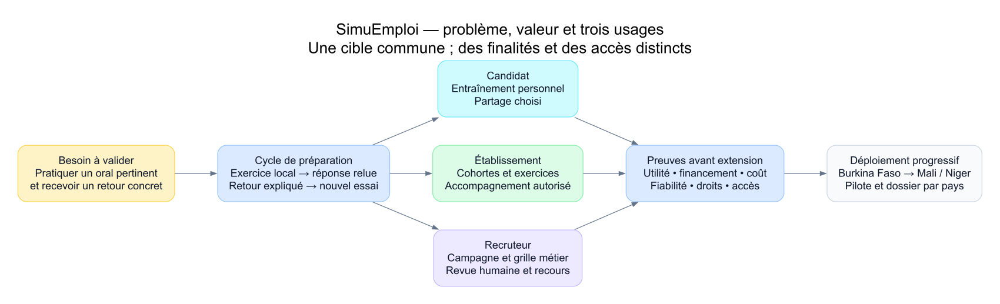

[Version SVG](visuels/valeur-et-usages.svg) · [Source Graphviz](visuels/valeur-et-usages.dot)

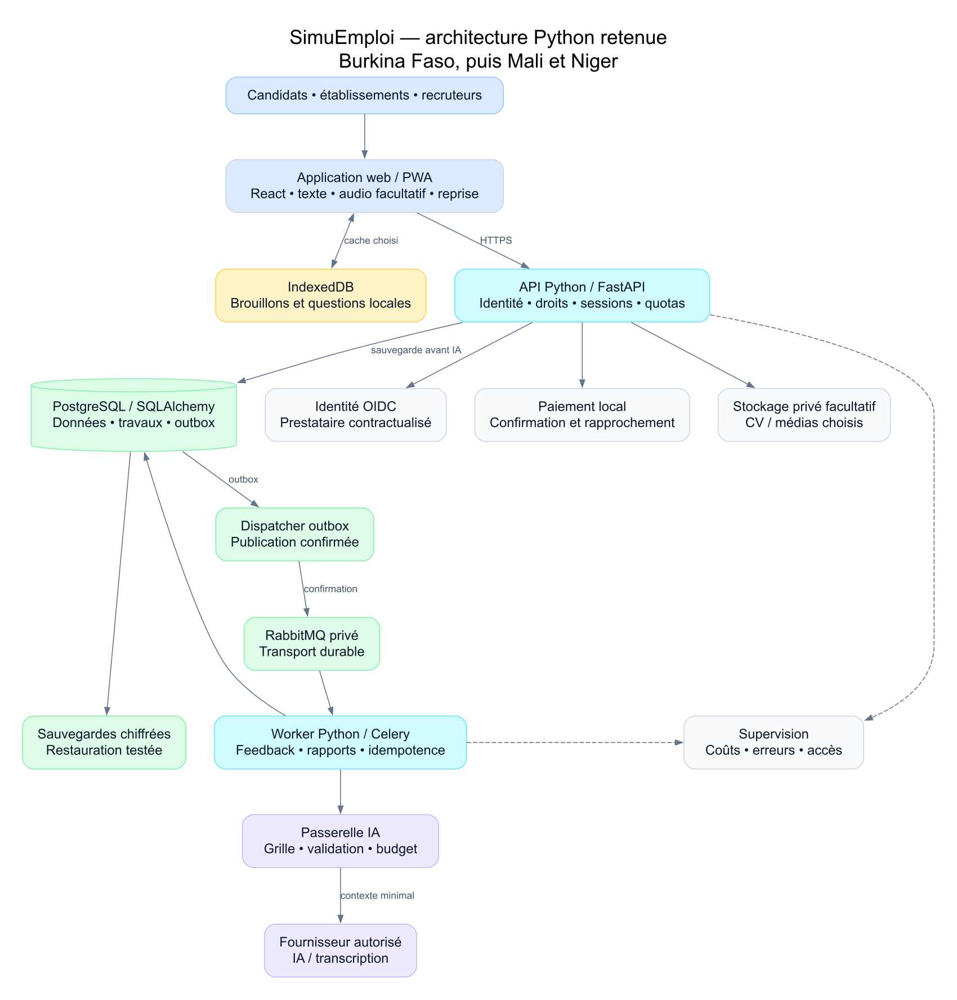

[Version SVG](visuels/architecture-synthese.svg) · [Source Graphviz](visuels/architecture-synthese.dot)

## Catalogue

## 1. Problème et boucle de valeur

Explique le bénéfice attendu et le rôle de la répétition. La valeur doit être vérifiée auprès du public.

[Source modifiable](diagrammes/01-probleme-valeur.mmd)

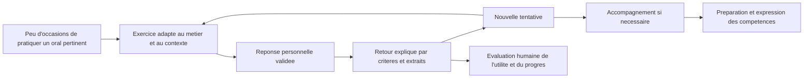
```mermaid
flowchart LR
    P[Peu d'occasions de pratiquer un oral pertinent] --> E[Exercice adapte au metier et au contexte]
    E --> R[Reponse personnelle validee]
    R --> F[Retour explique par criteres et extraits]
    F --> N[Nouvelle tentative]
    N --> A[Accompagnement si necessaire]
    A --> O[Preparation et expression des competences]
    N --> E
    F --> V[Evaluation humaine de l'utilite et du progres]
```

## 2. Contexte du système — C4 niveau 1

Montre les acteurs et fournisseurs externes. Les lieux de traitement et les contrats restent à sélectionner.

[Source modifiable](diagrammes/02-contexte-c4.mmd)

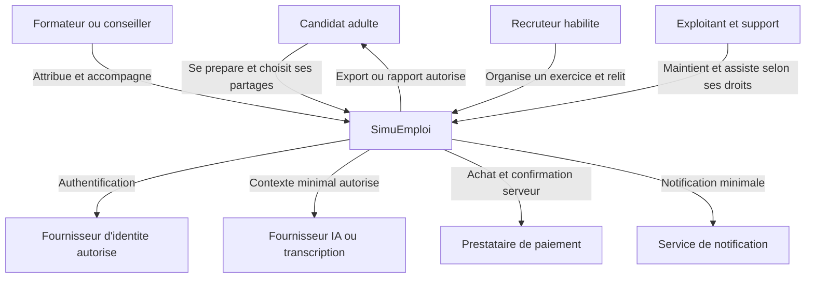
```mermaid
flowchart TB
    C[Candidat adulte] -->|Se prepare et choisit ses partages| S[SimuEmploi]
    F[Formateur ou conseiller] -->|Attribue et accompagne| S
    R[Recruteur habilite] -->|Organise un exercice et relit| S
    A[Exploitant et support] -->|Maintient et assiste selon ses droits| S
    S -->|Authentification| I[Fournisseur d'identite autorise]
    S -->|Contexte minimal autorise| G[Fournisseur IA ou transcription]
    S -->|Achat et confirmation serveur| P[Prestataire de paiement]
    S -->|Notification minimale| M[Service de notification]
    S -->|Export ou rapport autorise| C
```

## 3. Cas d’utilisation et acteurs

Carte fonctionnelle inspirée des cas d’utilisation UML. Mermaid représente ici les cas avec des nœuds et des liens, sans prétendre à une notation UML complète.

[Source modifiable](diagrammes/03-cas-utilisation.mmd)

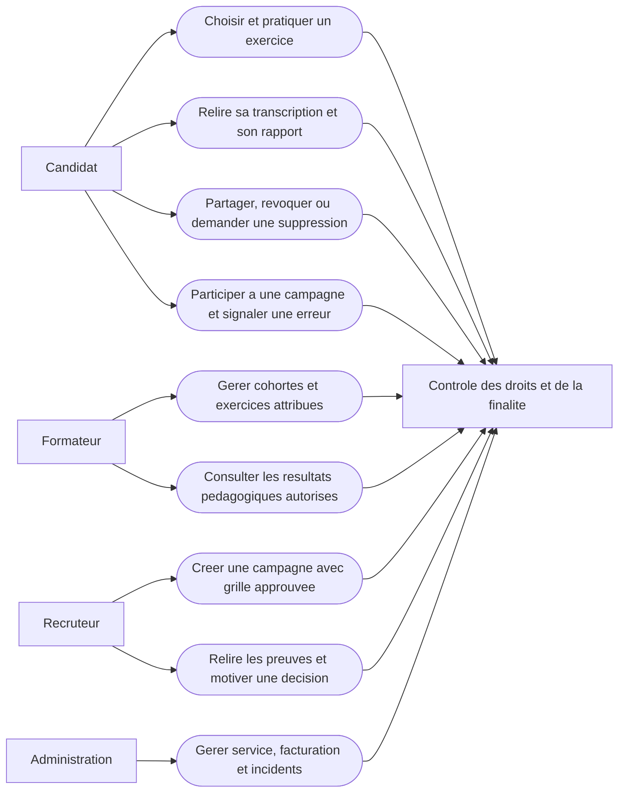
```mermaid
flowchart LR
    C[Candidat] --> U1([Choisir et pratiquer un exercice])
    C --> U2([Relire sa transcription et son rapport])
    C --> U3([Partager, revoquer ou demander une suppression])
    F[Formateur] --> U4([Gerer cohortes et exercices attribues])
    F --> U5([Consulter les resultats pedagogiques autorises])
    R[Recruteur] --> U6([Creer une campagne avec grille approuvee])
    R --> U7([Relire les preuves et motiver une decision])
    C --> U8([Participer a une campagne et signaler une erreur])
    A[Administration] --> U9([Gerer service, facturation et incidents])
    U1 --> D[Controle des droits et de la finalite]
    U2 --> D
    U3 --> D
    U4 --> D
    U5 --> D
    U6 --> D
    U7 --> D
    U8 --> D
    U9 --> D
```

## 4. Conteneurs applicatifs — C4 niveau 2

Sépare application web, API, worker, base, queue et prestataires. Un conteneur C4 est une unité logicielle, pas nécessairement un conteneur Docker.

[Source modifiable](diagrammes/04-conteneurs-c4.mmd)

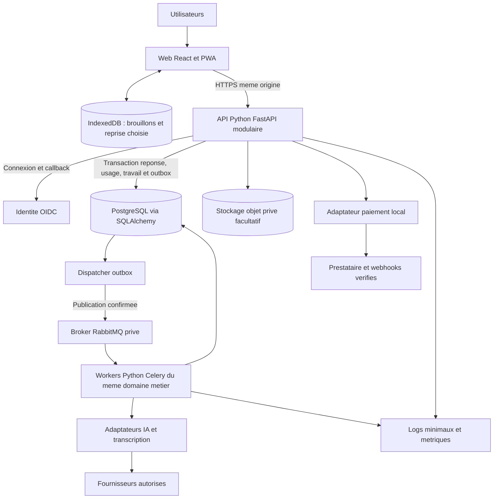
```mermaid
flowchart TB
    U[Utilisateurs] --> W[Web React et PWA]
    W <--> L[(IndexedDB : brouillons et reprise choisie)]
    W -->|HTTPS meme origine| API[API Python FastAPI modulaire]
    API -->|Connexion et callback| OIDC[Identite OIDC]
    API -->|Transaction reponse, usage, travail et outbox| DB[(PostgreSQL via SQLAlchemy)]
    DB --> DIS[Dispatcher outbox]
    DIS -->|Publication confirmee| Q[Broker RabbitMQ prive]
    Q --> WK[Workers Python Celery du meme domaine metier]
    WK --> DB
    WK --> AI[Adaptateurs IA et transcription]
    AI --> EXT[Fournisseurs autorises]
    API --> OBJ[(Stockage objet prive facultatif)]
    API --> PAY[Adaptateur paiement local]
    PAY --> PSP[Prestataire et webhooks verifies]
    API --> OBS[Logs minimaux et metriques]
    WK --> OBS
```

## 5. Composants métier — vue C4 niveau 3

Décrit les frontières des modules et les interactions principales. Les contrôles transversaux et dépôts sont précisés dans le dossier architecture.

[Source modifiable](diagrammes/05-composants-backend.mmd)

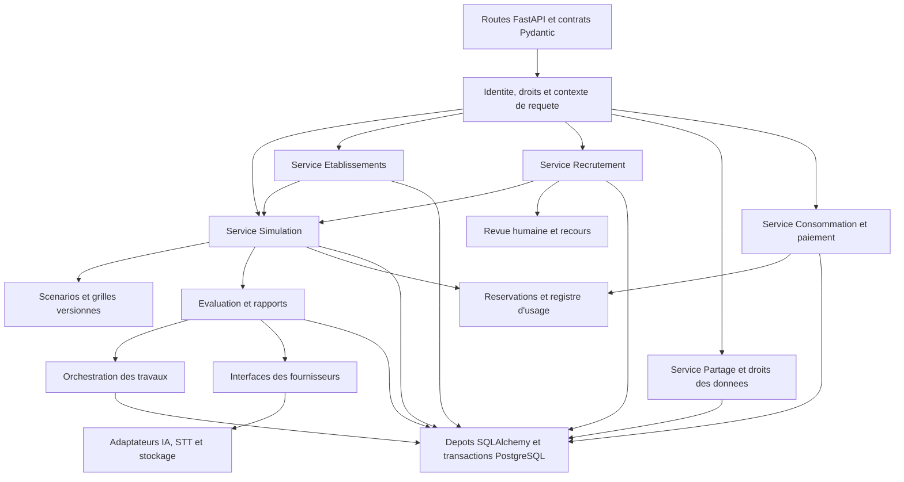
```mermaid
flowchart TB
    HTTP[Routes FastAPI et contrats Pydantic] --> AUTH[Identite, droits et contexte de requete]
    AUTH --> SIM[Service Simulation]
    AUTH --> EDU[Service Etablissements]
    AUTH --> REC[Service Recrutement]
    AUTH --> SHR[Service Partage et droits des donnees]
    AUTH --> BILL[Service Consommation et paiement]
    SIM --> REF[Scenarios et grilles versionnes]
    SIM --> EVA[Evaluation et rapports]
    EVA --> JOB[Orchestration des travaux]
    EVA --> PORT[Interfaces des fournisseurs]
    PORT --> AD[Adaptateurs IA, STT et stockage]
    EDU --> SIM
    REC --> SIM
    REC --> REV[Revue humaine et recours]
    SIM --> USG[Reservations et registre d'usage]
    BILL --> USG
    SIM --> REPO[Depots SQLAlchemy et transactions PostgreSQL]
    EDU --> REPO
    REC --> REPO
    SHR --> REPO
    BILL --> REPO
    JOB --> REPO
    EVA --> REPO
```

## 6. Modèle entités-relations

Montre les relations centrales. Certains champs/tables sont omis pour garder la vue lisible ; les contraintes détaillées figurent dans le dossier architecture. La paire identity_issuer/identity_subject est unique. Organization est facultative pour une session personnelle. Un rapport cite ses évaluations par une relation explicite. La revendication et la révision des travaux protègent les résultats tardifs.

[Source modifiable](diagrammes/06-donnees-principales.mmd)

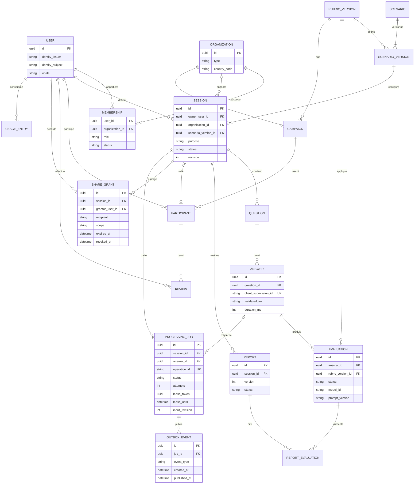
```mermaid
erDiagram
    USER ||--o{ MEMBERSHIP : appartient
    ORGANIZATION ||--o{ MEMBERSHIP : possede
    USER ||--o{ SESSION : detient
    ORGANIZATION |o--o{ SESSION : encadre
    SCENARIO ||--|{ SCENARIO_VERSION : versionne
    RUBRIC_VERSION ||--o{ SCENARIO_VERSION : definit
    SCENARIO_VERSION ||--o{ SESSION : configure
    SESSION ||--o{ QUESTION : contient
    QUESTION ||--o{ ANSWER : recoit
    ANSWER ||--o{ EVALUATION : produit
    RUBRIC_VERSION ||--o{ EVALUATION : applique
    SESSION ||--o{ REPORT : restitue
    REPORT ||--o{ REPORT_EVALUATION : cite
    EVALUATION ||--o{ REPORT_EVALUATION : alimente
    ORGANIZATION ||--o{ CAMPAIGN : organise
    RUBRIC_VERSION ||--o{ CAMPAIGN : fige
    CAMPAIGN ||--o{ PARTICIPANT : inscrit
    USER ||--o{ PARTICIPANT : participe
    SESSION |o--o| PARTICIPANT : relie
    PARTICIPANT ||--o{ REVIEW : recoit
    USER ||--o{ REVIEW : effectue
    USER ||--o{ SHARE_GRANT : accorde
    SESSION ||--o{ SHARE_GRANT : partage
    USER ||--o{ USAGE_ENTRY : consomme
    SESSION ||--o{ PROCESSING_JOB : traite
    ANSWER |o--o{ PROCESSING_JOB : concerne
    PROCESSING_JOB ||--o{ OUTBOX_EVENT : publie
    USER {
        uuid id PK
        string identity_issuer
        string identity_subject
        string locale
    }
    ORGANIZATION {
        uuid id PK
        string type
        string country_code
    }
    MEMBERSHIP {
        uuid user_id FK
        uuid organization_id FK
        string role
        string status
    }
    SESSION {
        uuid id PK
        uuid owner_user_id FK
        uuid organization_id FK
        uuid scenario_version_id FK
        string purpose
        string status
        int revision
    }
    ANSWER {
        uuid id PK
        uuid question_id FK
        string client_submission_id UK
        string validated_text
        int duration_ms
    }
    EVALUATION {
        uuid id PK
        uuid answer_id FK
        uuid rubric_version_id FK
        string status
        string model_id
        string prompt_version
    }
    REPORT {
        uuid id PK
        uuid session_id FK
        int version
        string status
    }
    SHARE_GRANT {
        uuid id PK
        uuid session_id FK
        uuid grantor_user_id FK
        string recipient
        string scope
        datetime expires_at
        datetime revoked_at
    }
    PROCESSING_JOB {
        uuid id PK
        uuid session_id FK
        uuid answer_id FK
        string operation_id UK
        string status
        int attempts
        uuid lease_token
        datetime lease_until
        int input_revision
    }
    OUTBOX_EVENT {
        uuid id PK
        uuid job_id FK
        string event_type
        datetime created_at
        datetime published_at
    }
```

## 7. Séquence : sauvegarder puis analyser une réponse

Le commit précède l’appel IA. La sortie est validée, l’échec annoncé et les réponses conservées.

[Source modifiable](diagrammes/07-sequence-reponse.mmd)

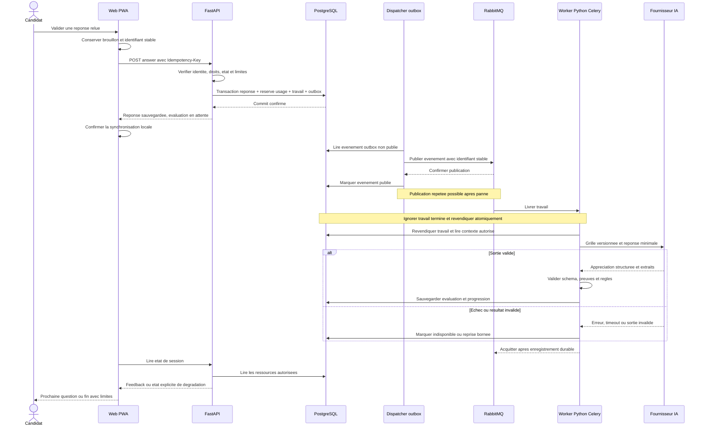
```mermaid
sequenceDiagram
    actor C as Candidat
    participant W as Web PWA
    participant A as FastAPI
    participant D as PostgreSQL
    participant P as Dispatcher outbox
    participant B as RabbitMQ
    participant J as Worker Python Celery
    participant I as Fournisseur IA
    C->>W: Valider une reponse relue
    W->>W: Conserver brouillon et identifiant stable
    W->>A: POST answer avec Idempotency-Key
    A->>A: Verifier identite, droits, etat et limites
    A->>D: Transaction reponse + reserve usage + travail + outbox
    D-->>A: Commit confirme
    A-->>W: Reponse sauvegardee, evaluation en attente
    W->>W: Confirmer la synchronisation locale
    P->>D: Lire evenement outbox non publie
    P->>B: Publier evenement avec identifiant stable
    B-->>P: Confirmer publication
    P->>D: Marquer evenement publie
    Note over P,B: Publication repetee possible apres panne
    B->>J: Livrer travail
    Note over J,D: Ignorer travail termine et revendiquer atomiquement
    J->>D: Revendiquer travail et lire contexte autorise
    J->>I: Grille versionnee et reponse minimale
    alt Sortie valide
        I-->>J: Appreciation structuree et extraits
        J->>J: Valider schema, preuves et regles
        J->>D: Sauvegarder evaluation et progression
    else Echec ou resultat invalide
        I-->>J: Erreur, timeout ou sortie invalide
        J->>D: Marquer indisponible ou reprise bornee
    end
    J-->>B: Acquitter apres enregistrement durable
    W->>A: Lire etat de session
    A->>D: Lire les ressources autorisees
    A-->>W: Feedback ou etat explicite de degradation
    W-->>C: Prochaine question ou fin avec limites
```

## 8. Séquence : coupure réseau et synchronisation

Les soumissions gardent un identifiant stable. Un changement de compte ou de droits produit un refus explicite ; les brouillons ne sont pas transmis à un autre utilisateur.

[Source modifiable](diagrammes/08-sequence-reprise.mmd)

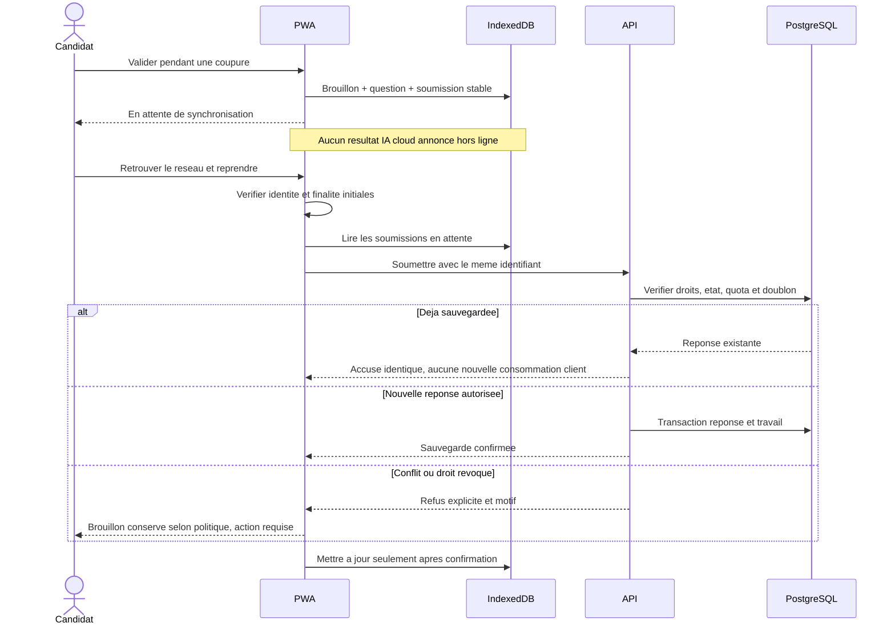
```mermaid
sequenceDiagram
    actor C as Candidat
    participant W as PWA
    participant L as IndexedDB
    participant A as API
    participant D as PostgreSQL
    C->>W: Valider pendant une coupure
    W->>L: Brouillon + question + soumission stable
    W-->>C: En attente de synchronisation
    Note over W,L: Aucun resultat IA cloud annonce hors ligne
    C->>W: Retrouver le reseau et reprendre
    W->>W: Verifier identite et finalite initiales
    W->>L: Lire les soumissions en attente
    W->>A: Soumettre avec le meme identifiant
    A->>D: Verifier droits, etat, quota et doublon
    alt Deja sauvegardee
        D-->>A: Reponse existante
        A-->>W: Accuse identique, aucune nouvelle consommation client
    else Nouvelle reponse autorisee
        A->>D: Transaction reponse et travail
        A-->>W: Sauvegarde confirmee
    else Conflit ou droit revoque
        A-->>W: Refus explicite et motif
        W-->>C: Brouillon conserve selon politique, action requise
    end
    W->>L: Mettre a jour seulement apres confirmation
```

## 9. États d’une session

Les transitions dépendent de règles serveur. Les actions de fin concurrentes et les travaux en retard sont contrôlés par état/révision.

[Source modifiable](diagrammes/09-etats-session.mmd)

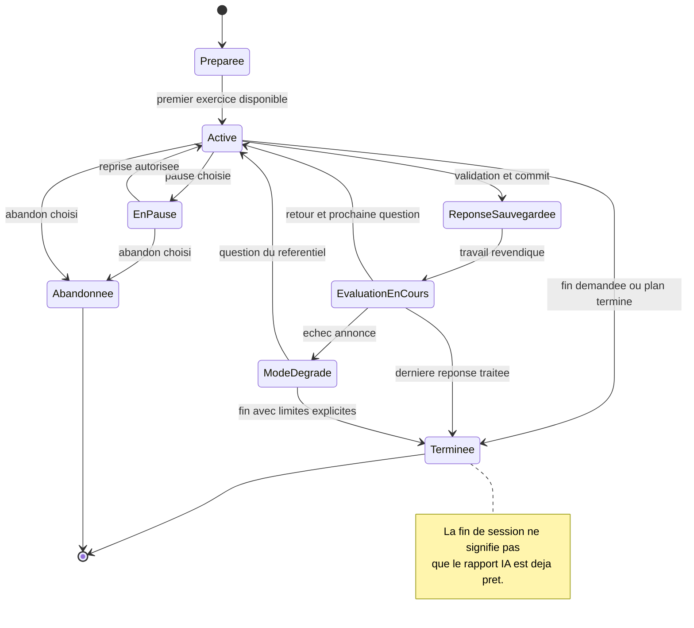
```mermaid
stateDiagram-v2
    [*] --> Preparee
    Preparee --> Active: premier exercice disponible
    Active --> ReponseSauvegardee: validation et commit
    ReponseSauvegardee --> EvaluationEnCours: travail revendique
    EvaluationEnCours --> Active: retour et prochaine question
    EvaluationEnCours --> ModeDegrade: echec annonce
    ModeDegrade --> Active: question du referentiel
    Active --> EnPause: pause choisie
    EnPause --> Active: reprise autorisee
    Active --> Terminee: fin demandee ou plan termine
    EvaluationEnCours --> Terminee: derniere reponse traitee
    ModeDegrade --> Terminee: fin avec limites explicites
    EnPause --> Abandonnee: abandon choisi
    Active --> Abandonnee: abandon choisi
    Terminee --> [*]
    Abandonnee --> [*]
    note right of Terminee
        La fin de session ne signifie pas
        que le rapport IA est deja pret.
    end note
```

## 10. États d’un rapport

Une session terminée peut avoir un rapport en attente ou indisponible. Une reprise conserve la provenance et les révisions.

[Source modifiable](diagrammes/10-etats-rapport.mmd)

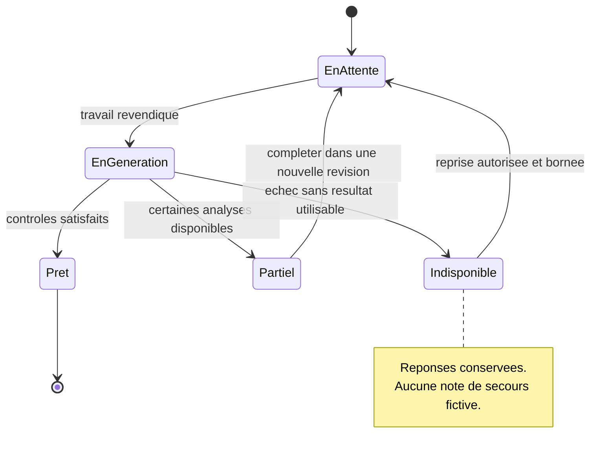
```mermaid
stateDiagram-v2
    [*] --> EnAttente
    EnAttente --> EnGeneration: travail revendique
    EnGeneration --> Pret: controles satisfaits
    EnGeneration --> Partiel: certaines analyses disponibles
    EnGeneration --> Indisponible: echec sans resultat utilisable
    Indisponible --> EnAttente: reprise autorisee et bornee
    Partiel --> EnAttente: completer dans une nouvelle revision
    Pret --> [*]
    note right of Indisponible
        Reponses conservees.
        Aucune note de secours fictive.
    end note
```

## 11. Séquence : paiement et déduplication

La confirmation serveur et l’événement unique contrôlent le crédit. Un statut incertain exige un rapprochement.

[Source modifiable](diagrammes/11-sequence-paiement.mmd)

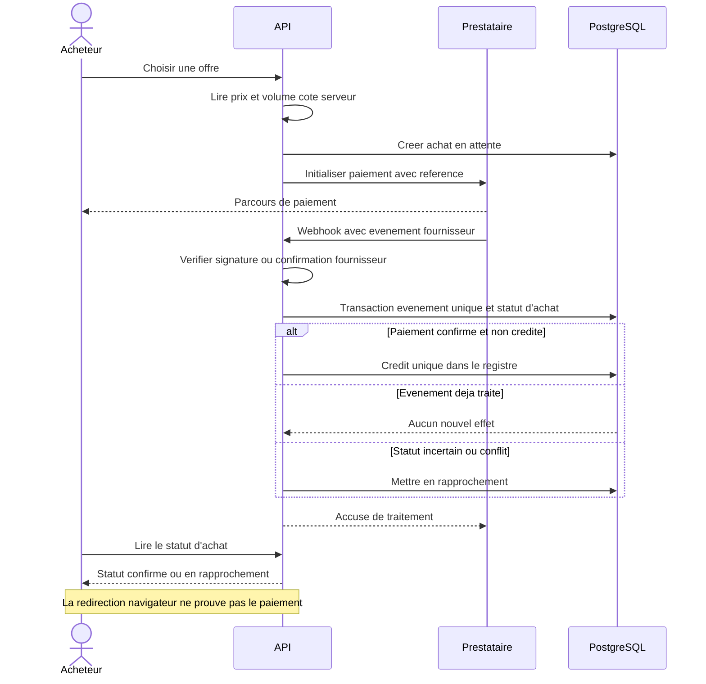
```mermaid
sequenceDiagram
    actor C as Acheteur
    participant A as API
    participant P as Prestataire
    participant D as PostgreSQL
    C->>A: Choisir une offre
    A->>A: Lire prix et volume cote serveur
    A->>D: Creer achat en attente
    A->>P: Initialiser paiement avec reference
    P-->>C: Parcours de paiement
    P->>A: Webhook avec evenement fournisseur
    A->>A: Verifier signature ou confirmation fournisseur
    A->>D: Transaction evenement unique et statut d'achat
    alt Paiement confirme et non credite
        A->>D: Credit unique dans le registre
    else Evenement deja traite
        D-->>A: Aucun nouvel effet
    else Statut incertain ou conflit
        A->>D: Mettre en rapprochement
    end
    A-->>P: Accuse de traitement
    C->>A: Lire le statut d'achat
    A-->>C: Statut confirme ou en rapprochement
    Note over C,A: La redirection navigateur ne prouve pas le paiement
```

## 12. Évaluation recruteur et revue humaine

Les données de campagne sont séparées du coaching privé. La sélection reste sous contrôle humain avec correction/recours.

[Source modifiable](diagrammes/12-revue-recruteur.mmd)

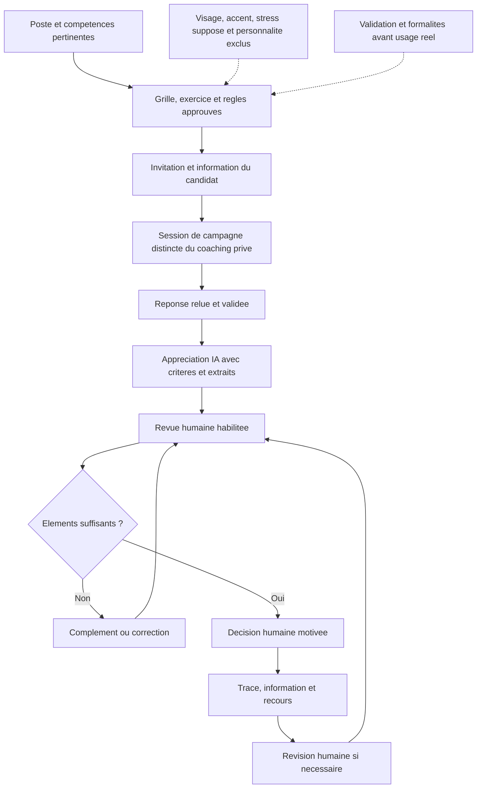
```mermaid
flowchart TB
    P[Poste et competences pertinentes] --> G[Grille, exercice et regles approuves]
    G --> I[Invitation et information du candidat]
    I --> S[Session de campagne distincte du coaching prive]
    S --> R[Reponse relue et validee]
    R --> E[Appreciation IA avec criteres et extraits]
    E --> H[Revue humaine habilitee]
    H --> Q{Elements suffisants ?}
    Q -->|Non| C[Complement ou correction]
    C --> H
    Q -->|Oui| D[Decision humaine motivee]
    D --> A[Trace, information et recours]
    A --> V[Revision humaine si necessaire]
    V --> H
    N[Visage, accent, stress suppose et personnalite exclus] -.-> G
    L[Validation et formalites avant usage reel] -.-> G
```

## 13. Déploiement et frontières d’exploitation

Vue logique de production proposée. Emplacements, dimensionnement et niveaux de service doivent être validés par contrat et recette.

[Source modifiable](diagrammes/13-deploiement.mmd)

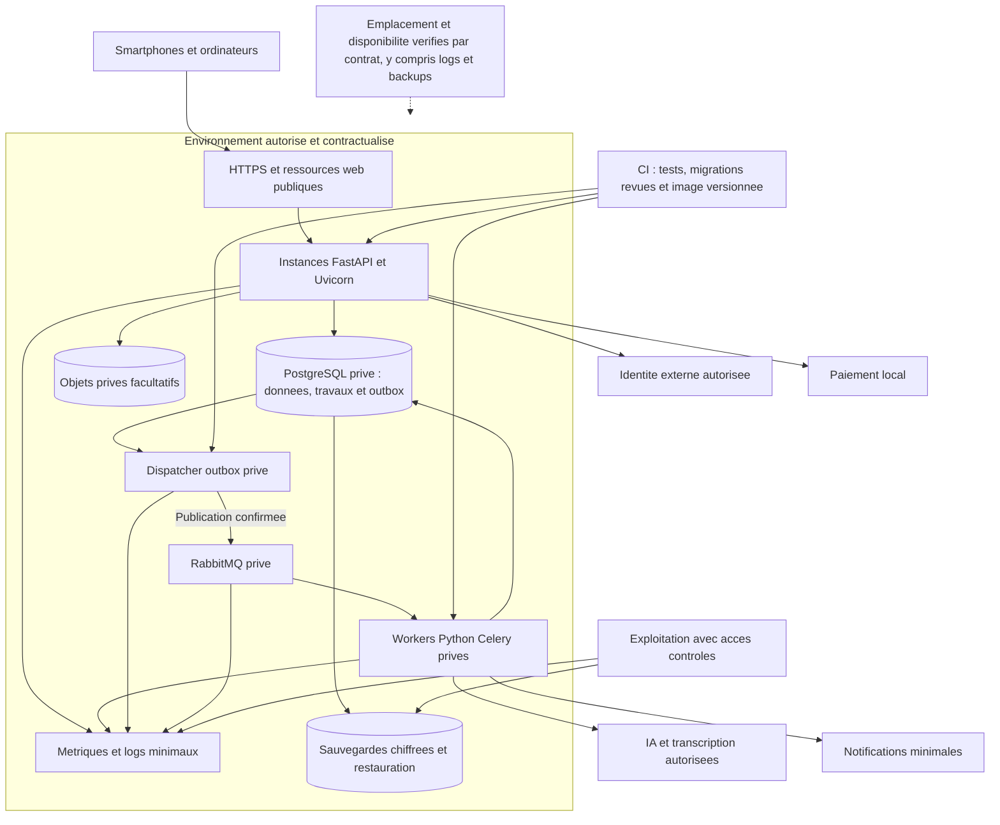
```mermaid
flowchart TB
    U[Smartphones et ordinateurs] --> EDGE[HTTPS et ressources web publiques]
    subgraph Z[Environnement autorise et contractualise]
        EDGE --> API[Instances FastAPI et Uvicorn]
        API --> DB[(PostgreSQL prive : donnees, travaux et outbox)]
        DB --> DIS[Dispatcher outbox prive]
        DIS -->|Publication confirmee| MQ[RabbitMQ prive]
        MQ --> WK[Workers Python Celery prives]
        WK --> DB
        API --> OBS[Metriques et logs minimaux]
        WK --> OBS
        DIS --> OBS
        MQ --> OBS
        DB --> BK[(Sauvegardes chiffrees et restauration)]
        API --> OBJ[(Objets prives facultatifs)]
    end
    API --> ID[Identite externe autorisee]
    API --> PAY[Paiement local]
    WK --> AI[IA et transcription autorisees]
    WK --> MAIL[Notifications minimales]
    OPS[Exploitation avec acces controles] --> OBS
    OPS --> BK
    CI[CI : tests, migrations revues et image versionnee] --> API
    CI --> WK
    CI --> DIS
    note[Emplacement et disponibilite verifies par contrat, y compris logs et backups] -.-> Z
```

## 14. Parcours de validation et extension

L’ouverture repose sur les preuves de valeur, coût et fiabilité. Le module recruteur a sa validation spécifique.

[Source modifiable](diagrammes/14-parcours-validation.mmd)

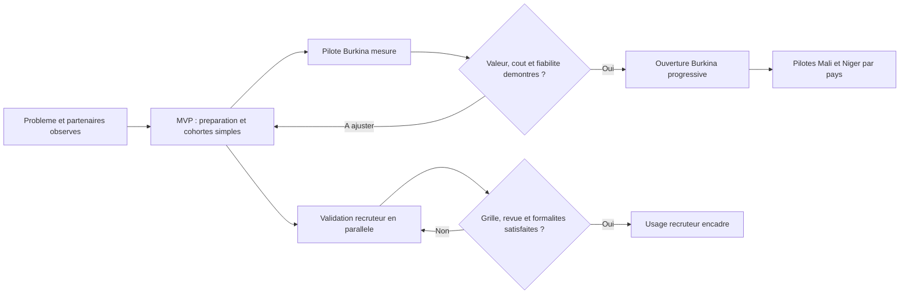
```mermaid
flowchart LR
    B[Probleme et partenaires observes] --> M[MVP : preparation et cohortes simples]
    M --> P[Pilote Burkina mesure]
    P --> V{Valeur, cout et fiabilite demontres ?}
    V -->|A ajuster| M
    V -->|Oui| O[Ouverture Burkina progressive]
    O --> AES[Pilotes Mali et Niger par pays]
    M --> REC[Validation recruteur en parallele]
    REC --> G{Grille, revue et formalites satisfaites ?}
    G -->|Oui| R[Usage recruteur encadre]
    G -->|Non| REC
```

## 15. Stack Python retenue — vue détaillée

FastAPI, PostgreSQL et workers Python Celery/RabbitMQ constituent la cible adoptée par le porteur. Le broker est une responsabilité supplémentaire à exploiter. Voir le dossier backend Python.

[Source modifiable](diagrammes/15-variante-python.mmd)

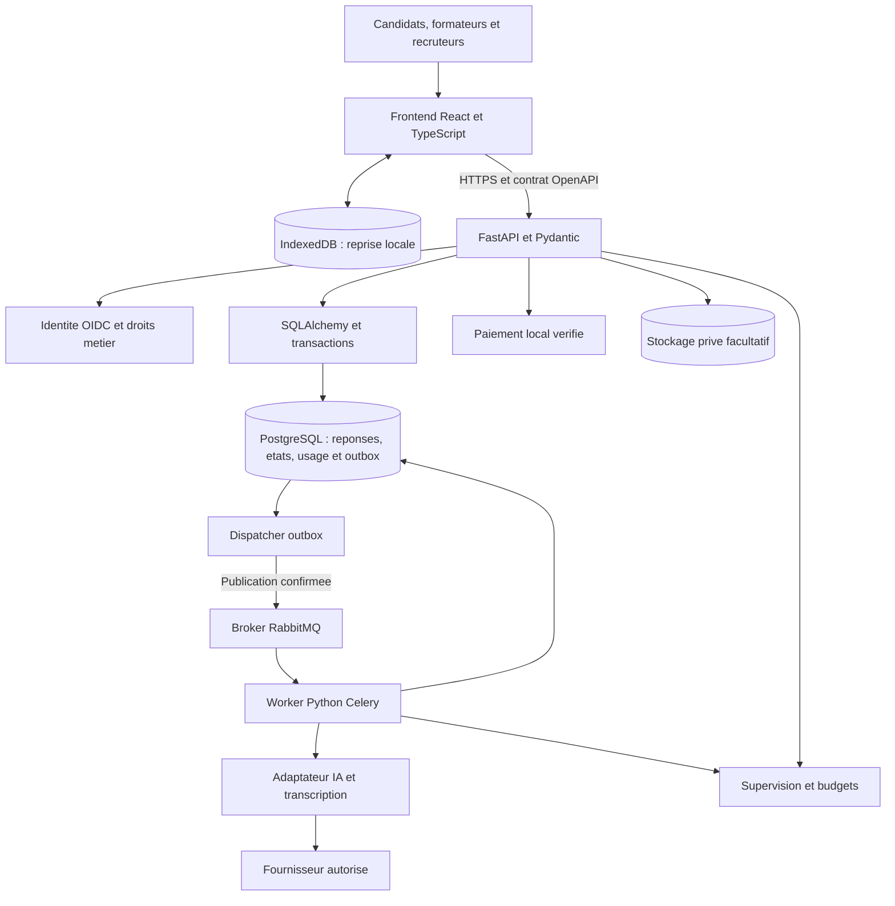
```mermaid
flowchart TB
    U[Candidats, formateurs et recruteurs] --> W[Frontend React et TypeScript]
    W <--> L[(IndexedDB : reprise locale)]
    W -->|HTTPS et contrat OpenAPI| API[FastAPI et Pydantic]
    API --> AUTH[Identite OIDC et droits metier]
    API --> ORM[SQLAlchemy et transactions]
    ORM --> DB[(PostgreSQL : reponses, etats, usage et outbox)]
    DB --> DIS[Dispatcher outbox]
    DIS -->|Publication confirmee| MQ[Broker RabbitMQ]
    MQ --> WK[Worker Python Celery]
    WK --> DB
    WK --> AI[Adaptateur IA et transcription]
    AI --> EXT[Fournisseur autorise]
    API --> PAY[Paiement local verifie]
    API --> OBJ[(Stockage prive facultatif)]
    API --> OBS[Supervision et budgets]
    WK --> OBS
```

## 16. Séquence Python : transaction et outbox

L’outbox empêche de perdre l’intention de traitement entre base et broker. Une répétition de publication reste possible et doit être absorbée par le worker ; un effet externe peut encore être répété.

[Source modifiable](diagrammes/16-python-outbox.mmd)

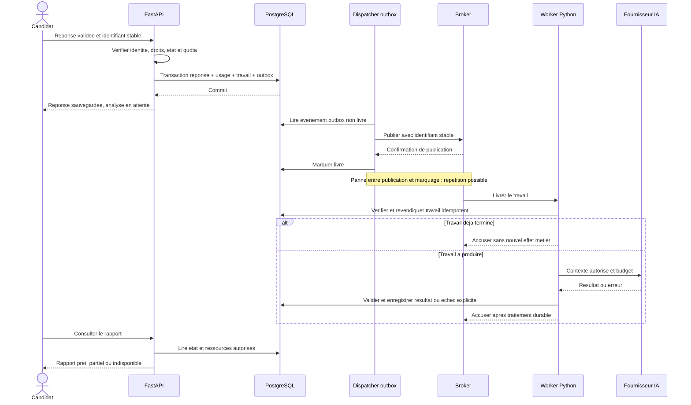
```mermaid
sequenceDiagram
    actor C as Candidat
    participant A as FastAPI
    participant D as PostgreSQL
    participant P as Dispatcher outbox
    participant B as Broker
    participant W as Worker Python
    participant I as Fournisseur IA
    C->>A: Reponse validee et identifiant stable
    A->>A: Verifier identite, droits, etat et quota
    A->>D: Transaction reponse + usage + travail + outbox
    D-->>A: Commit
    A-->>C: Reponse sauvegardee, analyse en attente
    P->>D: Lire evenement outbox non livre
    P->>B: Publier avec identifiant stable
    B-->>P: Confirmation de publication
    P->>D: Marquer livre
    Note over P,B: Panne entre publication et marquage : repetition possible
    B->>W: Livrer le travail
    W->>D: Verifier et revendiquer travail idempotent
    alt Travail deja termine
        W-->>B: Accuser sans nouvel effet metier
    else Travail a produire
        W->>I: Contexte autorise et budget
        I-->>W: Resultat ou erreur
        W->>D: Valider et enregistrer resultat ou echec explicite
        W-->>B: Accuser apres traitement durable
    end
    C->>A: Consulter le rapport
    A->>D: Lire etat et ressources autorises
    A-->>C: Rapport pret, partiel ou indisponible
```

## Vérification des représentations

La syntaxe des sources Mermaid a été contrôlée avec le parseur installé pour ce dossier. Deux vues Graphviz ont été générées en SVG et PNG ; leur contrôle visuel est documenté dans le rapport de livraison. La validation syntaxique ne prouve pas la qualité métier ni les performances de l’architecture.
